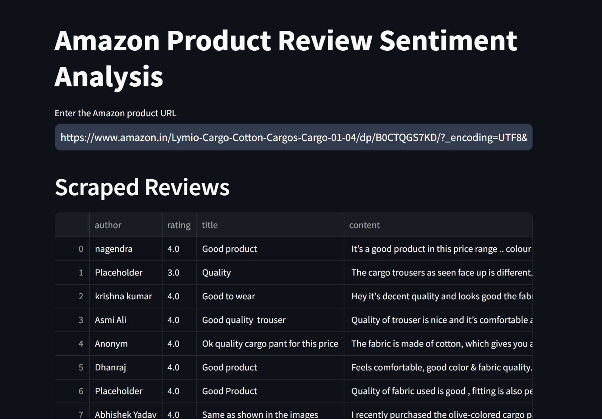

# Amazon Review Sentiment Analyzer



## Overview

Amazon Review Sentiment Analyzer is a web application that allows you to scrape product reviews from Amazon and perform sentiment analysis on them using a pre-trained BERT model. The application provides interactive visualizations such as bar charts and word clouds to help you quickly understand the overall sentiment of the reviews.

## Features

- **Web Scraping**: Automatically scrape reviews from any Amazon product page.
- **Sentiment Analysis**: Classify review sentiments (positive, negative) using a pre-trained BERT model.
- **Interactive Visualizations**: Display results with interactive charts and word clouds.

## Installation

1. **Clone the repository**:
    ```bash
    https://github.com/likhith214/Sentimental-Anaysis-by-Scraping-Reviews-from-Amazon-.git
    cd Sentimental-Anaysis-by-Scraping-Reviews-from-Amazon-
    ```

2. **Install the required dependencies**:
    ```bash
    pip install -r requirements.txt
    ```

3. **Download and install the ChromeDriver**:
    - Download the ChromeDriver from [here](https://sites.google.com/chromium.org/driver/downloads).
    - Ensure the `chromedriver.exe` is placed in the `chromedriver-win64` directory (or update the path in the code accordingly).

## Usage

1. **Run the application**:
    ```bash
    streamlit run main.py
    ```

2. **Open the application**:
    - Go to `http://localhost:8501` in your web browser.

3. **Enter the Amazon product URL**:
    - Input the URL of the Amazon product you want to analyze in the text input field.

4. **View the results**:
    - The application will scrape the reviews, perform sentiment analysis, and display the results with interactive visualizations.


## Dependencies

- **Streamlit**: For creating the web application.
- **Selenium**: For web scraping and interacting with the Amazon website.
- **BeautifulSoup**: For parsing the HTML content.
- **Transformers**: For sentiment analysis using the BERT model.
- **Pandas**: For data manipulation and analysis.
- **Matplotlib**: For creating plots and visualizations.
- **WordCloud**: For generating word clouds from the text data.

## Files

- `main.py`: The main application file that contains all the logic for scraping reviews, performing sentiment analysis, and displaying the results.

## Contributing

If you want to contribute to this project, please fork the repository and create a pull request. Feel free to open issues for any bugs or feature requests.


### Disclaimer

This project is intended for educational purposes only. Scraping Amazon's website is against their terms of service and should be done responsibly and ethically.
